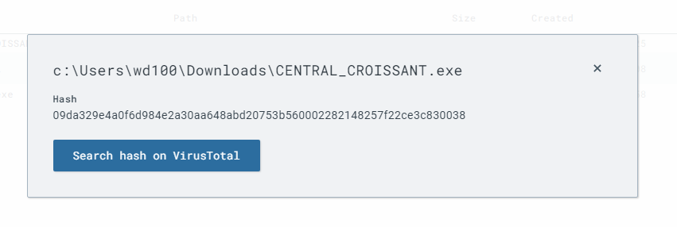
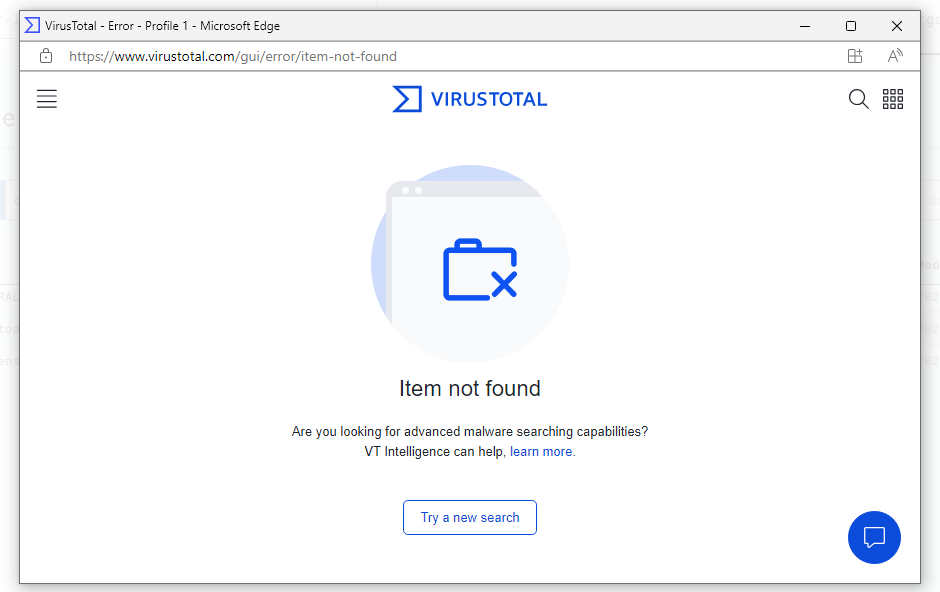
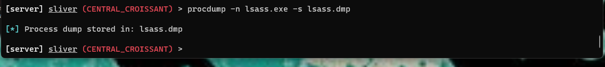
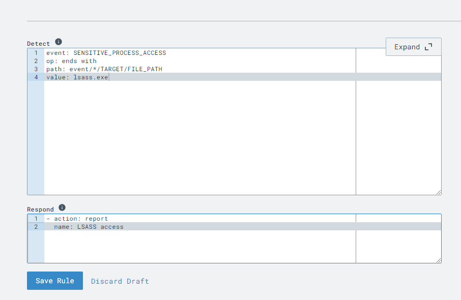
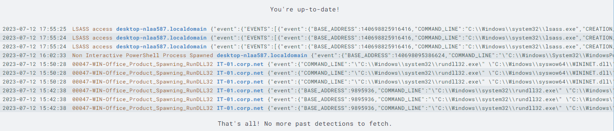
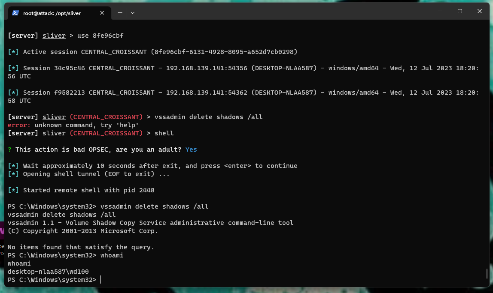
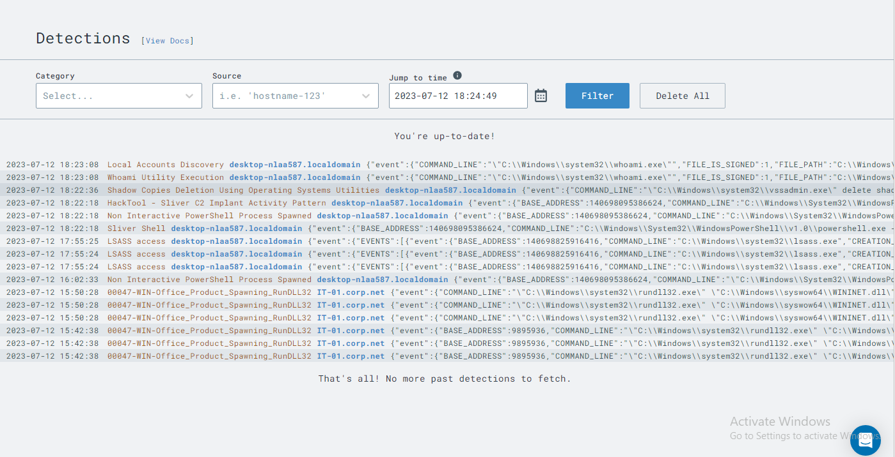
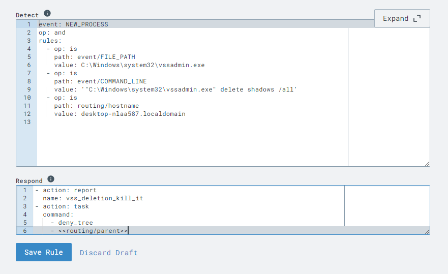
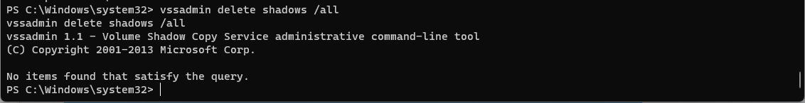

<h1>Endpoint Detection and Response Home Lab</h1>


<h2>Description</h2>
For this project, I created to Virtual machines to serve as my home lab. The first was a Linux VM, running Ubuntu Server. This was my attack platform. I used this machine to create noise and simulate attacks for my EDR LimaCharlie to detect. The second VM was a Windows 10 VM. This served as my vulnerable computer. I was able to execute malware on this VM through a program called Sliver through Powershell. This gave me administrative access to the Windows 10 VM.  
<br />


<h2>Languages and Utilities Used</h2>

- <b>PowerShell</b> 

<h2>Environments Used </h2>

- <b>VMware Workstation</b>
- <b>Ubuntu Server</b>
- <b>Windows 10 Pro</b>

<h2>Program walk-through:</h2>

<p align="center">
Create Ubuntu Server as attack VM: <br/>

<br />
<br />
Create Windows 10 VM as the vulnerable computer:  <br/>

<br />
<br />
Install LimaCharlie on Windows 10 VM for Endpoint, Detection, and Response: <br/>

<br />
<br />
Configure sensor in LimaCharlie to generate logs:  <br/>

<br />
<br />
Create a rule in LimaCharlie to ingest Sysmon logs:  <br/>

<br />
<br />
Access Ubuntu Server through SSH using Powershell:  <br/>

<br />
<br />
Download Sliver on Ubuntu Server:  <br/>

<br />
<br />
Use Sliver to generate malicious payload:  <br/>

<br />
<br />
Verify Malware is working:  <br/>

<br />
<br />
Begin attack by collecting information on infected machine:  <br/>

<br />
<br />
Examine network traffic using Netstat: <br/>

<br />
<br />
Review logs created in EDR:  <br/>

<br />
<br />
View file hash for the malicious download: <br/>

<br />
<br />
Search for the file hash in VirusTotal:  <br/>

<br />
<br />
Preform an LSASS Credential Dump:  <br/>

<br />
<br />
Review logs created by preforming LSASS dump:  <br/>

<br />
<br />
Create a rule to report LSASS credential dumping:  <br/>

<br />
<br />
Verify the new rule is functioning as designed:  <br/>

<br />
<br />
Attempt Volume Shadow Copies Deletion:  <br/>

<br />
<br />
Review logs created by VSS deletion attempt:  <br/>

<br />
<br />
Create a rule to detect and block a VSS deletion attempt:  <br/>

<br />
<br />
Verify the new rule terminates our connection to the infected machine:  <br/>

</p>

<!--
 ```diff
- text in red
+ text in green
! text in orange
# text in gray
@@ text in purple (and bold)@@
```
--!>
